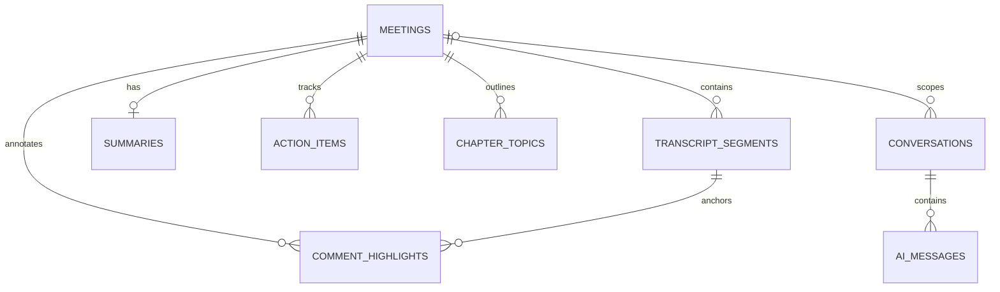

# Database Schema — Fireflies Meeting Intelligence

> This document describes both (a) the live SQLite file included in the supplied project archive and (b) the current SQLAlchemy ORM model layer. They are not identical: `conversations` and `ai_messages` exist in the database but are not defined in the inspected current ORM models. Their origin and whether the active application uses them remain unresolved.

## Database engine and location

- Engine: SQLite via SQLAlchemy 2.x.
- Default configured URL: `sqlite:///./fireflies.db` (relative to the backend process working directory; inspect `backend/app/core/config.py`).
- Supplied DB file: `backend/fireflies.db`.
- The seed script drops/recreates ORM-managed tables before inserting demo data. Do **not** run it against data you need to keep.
- Database snapshot at audit time: 5 meetings, 26 transcript segments, 5 summaries, 13 action items, 14 chapter topics, 6 comment/highlight annotations. Counts are a snapshot, not schema guarantees.

## Entity relationship overview

The last two relationships are based on foreign keys physically present in the supplied database only; they are **not** represented by current ORM model classes. The diagram indicates `scope_meeting_id` can be null and is set to null when its meeting is deleted.

## Column-level schema

SQLite types are shown as stored in the supplied database. SQLAlchemy/Python-level types may be more specific; SQLite itself has flexible typing.

### `action_items`

**Purpose/status:** Meeting tasks; defined in current ORM.

| Column | SQLite type | Required | Key/default | Notes |
|---|---|---:|---|---|
| `id` | `VARCHAR` | Yes | PK; default `—` | — |
| `meeting_id` | `VARCHAR` | Yes | FK; indexed/unique where applicable; default `—` | — |
| `text` | `TEXT` | Yes | —; default `—` | — |
| `assignee_name` | `VARCHAR` | No | —; default `—` | — |
| `completed` | `BOOLEAN` | Yes | —; default `—` | Boolean task state |
| `priority` | `VARCHAR` | No | —; default `—` | — |
| `due_date` | `DATETIME` | No | —; default `—` | — |

**Foreign keys**
- `meeting_id` → `meetings.id`; ON UPDATE `NO ACTION`, ON DELETE `CASCADE`.

**Indexes observed in SQLite:** `ix_action_items_meeting_id` (unique=False), `sqlite_autoindex_action_items_1` (unique=True).

### `ai_messages`

**Purpose/status:** Present in the SQLite file but not defined in current inspected ORM models; origin/usage unresolved.

| Column | SQLite type | Required | Key/default | Notes |
|---|---|---:|---|---|
| `id` | `VARCHAR` | Yes | PK; default `—` | — |
| `conversation_id` | `VARCHAR` | Yes | FK; default `—` | — |
| `role` | `VARCHAR` | Yes | —; default `—` | — |
| `content` | `TEXT` | Yes | —; default `—` | — |
| `found` | `BOOLEAN` | Yes | —; default `—` | — |
| `sources` | `JSON` | No | —; default `—` | Optional JSON source references |
| `created_at` | `DATETIME` | Yes | —; default `—` | — |

**Foreign keys**
- `conversation_id` → `conversations.id`; ON UPDATE `NO ACTION`, ON DELETE `CASCADE`.

**Indexes observed in SQLite:** `ix_ai_messages_conversation_id` (unique=False), `sqlite_autoindex_ai_messages_1` (unique=True).

### `chapter_topics`

**Purpose/status:** Seeded topic/chapter markers; defined in current ORM.

| Column | SQLite type | Required | Key/default | Notes |
|---|---|---:|---|---|
| `id` | `VARCHAR` | Yes | PK; default `—` | — |
| `meeting_id` | `VARCHAR` | Yes | FK; indexed/unique where applicable; default `—` | — |
| `title` | `VARCHAR` | Yes | —; default `—` | — |
| `start_time` | `FLOAT` | Yes | —; default `—` | Seconds into the media/transcript timeline |
| `summary_snippet` | `TEXT` | No | —; default `—` | — |

**Foreign keys**
- `meeting_id` → `meetings.id`; ON UPDATE `NO ACTION`, ON DELETE `CASCADE`.

**Indexes observed in SQLite:** `ix_chapter_topics_meeting_id` (unique=False), `sqlite_autoindex_chapter_topics_1` (unique=True).

### `comment_highlights`

**Purpose/status:** Transcript highlights/comments; defined in current ORM.

| Column | SQLite type | Required | Key/default | Notes |
|---|---|---:|---|---|
| `id` | `VARCHAR` | Yes | PK; default `—` | — |
| `meeting_id` | `VARCHAR` | Yes | FK; indexed/unique where applicable; default `—` | — |
| `segment_id` | `VARCHAR` | Yes | FK; default `—` | — |
| `selected_text` | `TEXT` | No | —; default `—` | — |
| `start_offset` | `INTEGER` | No | —; default `—` | Character offsets into selected transcript segment text |
| `end_offset` | `INTEGER` | No | —; default `—` | Character offsets into selected transcript segment text |
| `comment_text` | `TEXT` | No | —; default `—` | — |
| `color_code` | `VARCHAR` | No | —; default `—` | — |
| `annotation_type` | `VARCHAR` | No | —; default `—` | — |
| `author_name` | `VARCHAR` | Yes | —; default `—` | — |
| `created_at` | `DATETIME` | Yes | —; default `—` | — |

**Foreign keys**
- `segment_id` → `transcript_segments.id`; ON UPDATE `NO ACTION`, ON DELETE `CASCADE`.
- `meeting_id` → `meetings.id`; ON UPDATE `NO ACTION`, ON DELETE `CASCADE`.

**Indexes observed in SQLite:** `ix_comment_highlights_meeting_id` (unique=False), `sqlite_autoindex_comment_highlights_1` (unique=True).

### `conversations`

**Purpose/status:** Present in the SQLite file but not defined in current inspected ORM models; origin/usage unresolved.

| Column | SQLite type | Required | Key/default | Notes |
|---|---|---:|---|---|
| `id` | `VARCHAR` | Yes | PK; default `—` | — |
| `title` | `VARCHAR` | Yes | —; default `—` | — |
| `scope_meeting_id` | `VARCHAR` | No | FK; default `—` | Nullable FK; ON DELETE SET NULL |
| `created_at` | `DATETIME` | Yes | —; default `—` | — |
| `updated_at` | `DATETIME` | Yes | —; default `—` | — |

**Foreign keys**
- `scope_meeting_id` → `meetings.id`; ON UPDATE `NO ACTION`, ON DELETE `SET NULL`.

**Indexes observed in SQLite:** `ix_conversations_scope_meeting_id` (unique=False), `sqlite_autoindex_conversations_1` (unique=True).

### `meetings`

**Purpose/status:** Canonical meeting metadata; defined in current ORM.

| Column | SQLite type | Required | Key/default | Notes |
|---|---|---:|---|---|
| `id` | `VARCHAR` | Yes | PK; default `—` | — |
| `title` | `VARCHAR` | Yes | —; default `—` | — |
| `date` | `DATETIME` | Yes | —; default `—` | — |
| `duration_seconds` | `INTEGER` | Yes | —; default `—` | — |
| `audio_url` | `VARCHAR` | No | —; default `—` | — |
| `video_url` | `VARCHAR` | No | —; default `—` | — |
| `participants` | `JSON` | No | —; default `—` | JSON participant list (application convention) |
| `created_at` | `DATETIME` | Yes | —; default `—` | — |
| `updated_at` | `DATETIME` | Yes | —; default `—` | — |

**Foreign keys:** none.

**Indexes observed in SQLite:** `ix_meetings_title` (unique=False), `sqlite_autoindex_meetings_1` (unique=True).

### `summaries`

**Purpose/status:** One summary record per meeting; defined in current ORM.

| Column | SQLite type | Required | Key/default | Notes |
|---|---|---:|---|---|
| `id` | `VARCHAR` | Yes | PK; default `—` | — |
| `meeting_id` | `VARCHAR` | Yes | FK; indexed/unique where applicable; default `—` | — |
| `overview` | `TEXT` | Yes | —; default `—` | — |
| `key_takeaways` | `JSON` | No | —; default `—` | JSON array |
| `discussion_bullets` | `JSON` | No | —; default `—` | JSON array |

**Foreign keys**
- `meeting_id` → `meetings.id`; ON UPDATE `NO ACTION`, ON DELETE `CASCADE`.

**Indexes observed in SQLite:** `sqlite_autoindex_summaries_2` (unique=True), `sqlite_autoindex_summaries_1` (unique=True).

### `transcript_segments`

**Purpose/status:** Timestamped transcript entries; defined in current ORM.

| Column | SQLite type | Required | Key/default | Notes |
|---|---|---:|---|---|
| `id` | `VARCHAR` | Yes | PK; default `—` | — |
| `meeting_id` | `VARCHAR` | Yes | FK; indexed/unique where applicable; default `—` | — |
| `start_time` | `FLOAT` | Yes | —; default `—` | Seconds, not a wall-clock time |
| `end_time` | `FLOAT` | Yes | —; default `—` | Seconds, not a wall-clock time |
| `speaker_name` | `VARCHAR` | Yes | —; default `—` | — |
| `speaker_avatar` | `VARCHAR` | No | —; default `—` | — |
| `text` | `TEXT` | Yes | —; default `—` | — |
| `sequence_order` | `INTEGER` | Yes | —; default `—` | — |

**Foreign keys**
- `meeting_id` → `meetings.id`; ON UPDATE `NO ACTION`, ON DELETE `CASCADE`.

**Indexes observed in SQLite:** `ix_transcript_segments_speaker_name` (unique=False), `ix_transcript_segments_meeting_id` (unique=False), `sqlite_autoindex_transcript_segments_1` (unique=True).

## Constraints and relationship notes

- Every ORM entity uses a string ID, normally generated as a UUID by `generate_uuid()`.
- Child records reference `meetings.id` with `ON DELETE CASCADE` for transcript segments, summaries, action items, chapters, and annotations.
- `summaries.meeting_id` is unique, enforcing at most one summary per meeting.
- Annotation rows reference both the meeting and a transcript segment. The service layer should ensure that the segment belongs to the same meeting; this should be included in CRUD verification.
- Indexes include meeting title, meeting foreign keys, and transcript speaker name. Exact SQLite index names are shown in each table section.
- JSON columns (`participants`, summary arrays, and `ai_messages.sources`) store serialized JSON values in SQLite.
- No explicit database migration framework was found in the supplied files. Table changes appear to rely on SQLAlchemy metadata/seed setup; production-safe migrations are a future improvement.

## ORM model coverage

Defined in `backend/app/models/meeting.py`:

- `MeetingModel` → `meetings`
- `TranscriptSegmentModel` → `transcript_segments`
- `SummaryModel` → `summaries`
- `ActionItemModel` → `action_items`
- `ChapterTopicModel` → `chapter_topics`
- `CommentHighlightModel` → `comment_highlights`

Present only in the database snapshot, with no matching class found in inspected current model source:

- `conversations`
- `ai_messages`

Do not treat the last two as active, supported product functionality until their origin, code path, and migration lifecycle are confirmed.

## Data semantics and caveats

- Transcript and chapter times are numeric seconds relative to a media/transcript timeline.
- Seeded transcript text and chapters are demonstration content; they are not generated from the bundled sample audio by a speech-to-text pipeline.
- The same sample WAV is referenced by multiple seeded meetings. Do not imply meeting-specific recordings or validated word-level alignment.
- Meeting participant data is a JSON field, not a normalized `participants` table.
- There are no user/account/team tables in the inspected ORM schema; the UI uses a default/static author identity for annotations and is not a multi-user collaborative system.
